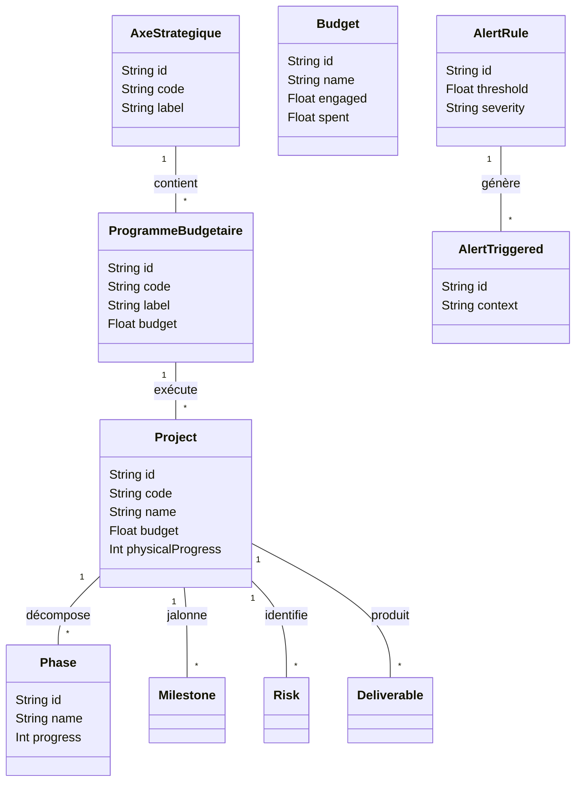

# Conception & Architecture Base de Données : SGG Pilotage

Ce document détaille la structure des données, les relations et les flux de persistance de l'application SGG Pilotage.

---

## 1. Modèle Conceptuel (UML Class Diagram)

L'architecture suit une approche hiérarchique alignée sur la **LOLF**.

---

## 2. Modèle Physique de Données (Types Prisma)

L'application utilise **PostgreSQL** comme moteur et **Prisma** comme ORM. Voici les définitions clés :

### Table : `projects` (@@map("projects"))
| Champ | Type Prisma | Rôle |
| :--- | :--- | :--- |
| `id` | `String (UUID)` | Clé Primaire |
| `code` | `String` | Identifiant Unique (ex: PRJ-2024-001) |
| `name` | `String` | Libellé du projet |
| `budget` | `Float` | Enveloppe totale en dirhams |
| `programmeId`| `String` | Clé Étrangère vers `programmes_budgetaires` |
| `dependencies`| `String[]` | Liste d'IDs de projets prérequis |

### Table : `budgets` (@@map("budgets"))
| Champ | Type Prisma | Rôle |
| :--- | :--- | :--- |
| `name` | `String` | Libellé de l'allocation (ex: Programme 140) |
| `engaged` | `Float` | Montant engagé (crédit) |
| `spent` | `Float` | Montant réellement consommé |
| `source` | `String` | MDD, INVEST, PNUD, etc. |

### Table : `alert_rules`
| Champ | Type Prisma | Rôle |
| :--- | :--- | :--- |
| `threshold` | `Float` | Seuil de déclenchement (ex: 0.9 pour 90%) |
| `operator` | `String` | Opération (>, <, =) |
| `severity` | `String` | Niveau d'alerte (warning, critical) |

---

## 3. Flux de Données Stratégiques

### A. Flux de Mise à Jour de Projet
1.  **Saisie UI** : L'utilisateur modifie l'avancement physique d'une phase.
2.  **State Management** : Le `DataContext` appelle `api.updateProject()`.
3.  **Persistance** : Prisma met à jour la table `phases`. Un **Trigger / Hook** (ou logique applicative) recalcule la moyenne pondérée dans la table `projects.physicalProgress`.

### B. Flux de Génération d'Alertes
1.  **Règle** : Une `AlertRule` définit un seuil (ex: Dépassement Budget).
2.  **Calcul** : Le moteur BI compare `Project.consumed` vs `Project.budget`.
3.  **Stockage** : Si le seuil est franchi, un enregistrement est créé dans `AlertTriggered` avec le contexte spécifique (ID du projet, date, dépassement exact).
4.  **Consommation** : Le Dashboard affiche les `AlertTriggered` non lues.

### C. Flux Budgétaire (Aggregation)
- Les données de `BudgetMonth` (saisie mensuelle) sont agrégées pour produire la courbe d'exécution cumulative.
- `spent_total = SUM(BudgetMonth.spent)`.

---

## 4. Intégrité & Contraintes
-   **OnDelete: Cascade** : Si un Projet est supprimé, toutes ses Phases, Risques et Livrables sont automatiquement supprimés.
-   **OnDelete: SetNull** : Si un Programme est supprimé, le champ `programmeId` des projets rattachés devient `null` (archivage sans perte de projet).
-   **Unique Constraints** : Le champ `code` des projets et l'index composite `[month, year]` de `BudgetMonth` empêchent les doublons.

---

> [!TIP]
> Pour générer un schéma visuel actualisé à tout moment, utilisez l'extension **Prisma ERD Generator**.
