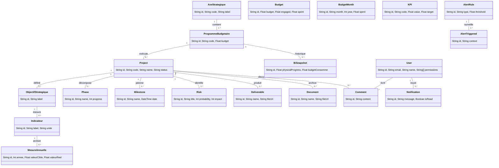

# Spécification Technique : Architecture de Base de Données (Exhaustive)

Ce document constitue le référentiel complet de la structure de données PostgreSQL gérée par Prisma pour l'application SGG Pilotage.

---

## 1. Modèle Conceptuel (UML Class Diagram)

Le diagramme ci-dessous illustre l'intégralité des relations entre les entités du système.

---

## 2. Dictionnaire de Données (20 Tables)

Toutes les tables sont mappées sur PostgreSQL via Prisma avec des noms explicites (`@@map`).

### 2.1. Module Stratégique & LOLF
1.  **Axes Stratégiques** (`axes_strategiques`) : Orientations stratégiques majeures du SGG.
2.  **Programmes Budgétaires** (`programmes_budgetaires`) : Enveloppes LOLF (ex: Programme 140).
3.  **Objectifs** (`objectifs_strategiques`) : Finalités stratégiques que le projet vise à atteindre.
4.  **Indicateurs** (`indicateurs`) : Indicateurs clés de performance liés aux objectifs (ex: Taux de couverture).
5.  **Mesures Annuelles** (`mesures_annuelles`) : Suivi des valeurs réelles vs Cibles par année pour chaque indicateur.

### 2.2. Module Gestion de Projet (PMO)
6.  **Projets** (`projects`) : Table pivot centrale incluant le budget projet et l'avancement.
7.  **Phases** (`phases`) : Décomposition temporelle des étapes du projet (Conception, Tests...).
8.  **Jalons** (`milestones`) : Points de décision et évènements clés datés.
9.  **Risques** (`risks`) : Registre des impondérables identifiés (Probabilité x Impact).
10. **Livrables** (`deliverables`) : Produits finis liés aux phases ou projets.
11. **Documents** (`documents`) : Pièces jointes administratives et archives.
12. **Commentaires** (`comments`) : Journal d'interactions collaboratives sur le projet.

### 2.3. Module Budget & Exécution
13. **Budgets (Allocations)** (`budgets`) : Gestion des enveloppes budgétaires globales par source de financement.
14. **Monitoring Mensuel** (`budget_months`) : Historique d'exécution financière mois par mois.

### 2.4. Intelligence & Alertes
15. **KPIs Globaux** (`kpis`) : Indicateurs transversaux calculés pour le pilotage stratégique global.
16. **BI Snapshots** (`bi_snapshots`) : Captures de performance pour générer les graphiques d'évolution historique.
17. **Règles d'Alerte** (`alert_rules`) : Seuils intelligents configurables.
18. **Alertes Déclenchées** (`alerts_triggered`) : Registre des dépassements ou retards détectés automatiquement.

### 2.5. Système & Notifications
19. **Utilisateurs** (`users`) : Comptes utilisateurs, profils et permissions (RBAC).
20. **Notifications** (`notifications`) : Alertes UI destinées aux utilisateurs pour les actions requises.

---

## 3. Détail des Types & Contraintes (Physique)

| Concept SQL | Implémentation Prisma | Notes |
| :--- | :--- | :--- |
| **Primary Key** | `@id @default(uuid())` | Identifiants uniques universels. |
| **Foreign Key** | `@relation(fields, references)` | Garantit l'intégrité référentielle stricte. |
| **Default Values** | `@default(0)` | Initialisation automatique des compteurs financiers. |
| **Dates Auto** | `@default(now())` / `@updatedAt` | Horodatage automatique des créations et mises à jour. |
| **Unicité** | `@unique` | Utilisé pour les codes (`code`) et les index temporels. |

---

## 4. Logique d'Intégrité Référentielle

- **Cascade Delete** : Appliqué aux dépendances opérationnelles (`Phase`, `Milestone`, `Risk`, `Indicateur`). Si le projet ou l'objectif parent disparaît, les données liées sont supprimées proprement.
- **SetNull** : Utilisé pour les relations structurelles (`axeId`, `programmeId`). Permet de restructurer la hiérarchie sans perdre les données subjacentes.

---
> [!IMPORTANT]
> Cette structure permet un pilotage à 360° en croisant les données stratégiques (LOLF) et les réalités opérationnelles (PMO) au sein d'un moteur décisionnel unique.
