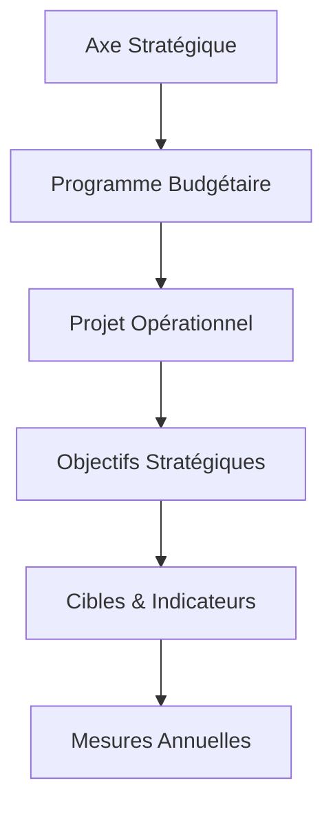

# Documentation Fonctionnelle : SGG Pilotage (Modernisé)

Ce document détaille les fonctionnalités, la logique métier et l'architecture fonctionnelle de la plateforme de pilotage du Secrétariat Général du Gouvernement (SGG).

---

## 1. Vision & Architecture LOLF
Le système est conçu autour de la **Loi Organique relative aux Lois de Finances (LOLF)**, garantissant un alignement entre la stratégie de l'État et l'exécution opérationnelle.

### Hiérarchie des Données

*   **Axe Stratégique** : Orientation politique majeure (ex: Modernisation de l'Administration).
*   **Programme Budgétaire** : Unité de gestion budgétaire (ex: Programme 140).
*   **Projet** : Action concrète menée par une direction SGG.
*   **Indicateur (KPI)** : Mesure de la performance liée à un objectif (ex: Taux de dématérialisation).

---

## 2. Gestion du Portefeuille de Projets (PMO)
Chaque projet suit une méthodologie rigoureuse pour assurer sa livraison.

### Cycle de Vie & Phases
Les projets passent par 4 statuts principaux : **Planification**, **En cours**, **Terminé**, ou **En retard**. Les phases types incluent :
- Conception / Étude
- Réalisation / Déploiement
- Tests / Recette
- Clôture

### Fonctionnalités Clés :
-   **Suivi du progrès** : Distinction entre avancement **Physique** (réalisation technique) et **Financier** (consommation du budget).
-   **Gestion des Livrables** : Dépôt de documents (PDF, Word, Images) pour prouver l'état d'avancement.
-   **Analyse des Risques** : Identification, évaluation (Probabilité x Impact) et plan d'atténuation.
-   **Jalons (Milestones)** : Dates clés critiques dont le non-respect déclenche des alertes.

---

## 3. Pilotage Financier & Budget
Le module Budget permet une gestion manuelle fine en l'absence de synchronisation GID automatique.

### Sources de Financement
Le système trace l'origine de chaque dirham via les sources suivantes :
-   **MDD / INVEST** : Budget général de l'État.
-   **PNUD / DIO / FONDS ANRT** : Coopération internationale ou fonds spéciaux.

### Logique de Calcul :
-   **Allocation** : Enveloppe globale allouée à un programme ou une thématique.
-   **Engagé** : Montant des marchés signés ou commandes passées.
-   **Consommé** : Montant réellement décaissé (paiements effectués).
-   **Suivi Mensuel** : Saisie mois par mois pour générer les courbes de tendance (Cumulative vs Prévisionnelle).

---

## 4. Intelligence Décisionnelle & Alertes
Le "cerveau" de l'application est son **Moteur d'Alertes**.

### Règles d'Alertes Automatiques :
Le système évalue en temps réel les dérives selon les règles suivantes :
1.  **Retard Physique** : Si le progrès physique est inférieur à un seuil défini alors que la date de fin approche.
2.  **Dépassement Budgétaire** : Si Consommé > Budget alloué.
3.  **Projet en Souffrance** : Si aucune mise à jour n'a été faite depuis 30 jours.
4.  **KPI Gap** : Si l'écart entre la valeur réelle et la cible d'un indicateur LOLF dépasse 20%.

### Dashboard BI :
-   **Visualisation** : Graphiques Recharts (Barres, Aires, Points).
-   **Filtres dynamiques** : Filtrage par Source de budget, par Programme ou par Statut.
-   **Export PDF** : Génération de la "Fiche Projet" complète pour impression officielle.

---

## 5. Profils et Droits d'Accès
L'accès aux données est sécurisé selon le profil (RBAC) :

1.  **Administrateur SGG** : Contrôle total, configuration des alertes, gestion des budgets.
2.  **Responsable Programme** : Vue consolidée sur un programme budgétaire, validation des KPIs.
3.  **Chef de Projet** : Mise à jour des phases, dépôt des livrables, gestion des risques de ses projets uniquement.
4.  **Auditeur (Read-only)** : Consultation de toutes les données et rapports pour inspection.

---

> [!NOTE] 
> Cette documentation est mise à jour automatiquement lors de l'ajout de nouveaux modules fonctionnels (ex: Intégration future avec GID).
