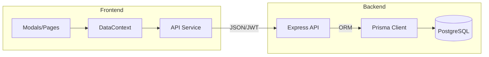

# Guide de Référent Technique : SGG Pilotage

Ce document est destiné aux équipes techniques (développeurs, architectes, DevOps) pour faciliter la maintenance, l'évolution et le déploiement du système de pilotage du SGG.

---

## 🛠️ 1. Stack Technologique

### Frontend (Client)
- **Framework** : React 19 (Vite 8)
- **State Management** : React Context API (Modularisé)
- **Styling** : Vanilla CSS + TailwindCSS (configuré)
- **Visualisation** : Recharts
- **Navigation** : React Router DOM 7

### Backend (API)
- **Runtime** : Node.js (V3.x+)
- **Framework** : Express 5
- **ORM** : Prisma 6
- **Database** : PostgreSQL (Local/Container)
- **Auth** : JWT (JsonWebToken) + bcryptjs
- **Uploads** : Multer

---

## 🏗️ 2. Architecture Globale

Le projet suit une séparation stricte entre le client (Vite) et le serveur (Express).

---

## 📊 3. Modèle de Données (Prisma Schema)

Le schéma (`server/prisma/schema.prisma`) est le pivot central de l'application.

-   **Hiérarchie LOLF** : 
    - `AxeStrategique` 1:N `ProgrammeBudgetaire`.
    - `ProgrammeBudgetaire` 1:N `Project`.
-   **Gestion Financière** : 
    - `Budget` : Stocke les allocations par programme et source.
    - `BudgetMonth` : Stocke l'exécution historique (prévisionnel vs réel).
-   **Gestion PMO** : 
    - `Project` : Table centrale liée aux `Phase`, `Milestone`, `Risk` et `Deliverable`.

---

## 🔐 4. Sécurité & Authentification

### Mécanisme JWT
- **Login** : L'API `/api/auth/login` génère un token JWT signé avec `JWT_SECRET`.
- **Persistance** : Le token est stocké dans le `localStorage` du navigateur.
- **Middleware** : `authenticateToken` vérifie la validité du token sur les routes sensibles (voir `server/src/middleware/auth.js`).

### Rôles (RBAC)
Le middleware vérifie le rôle présent dans le payload du token (`admin`, `manager`, `viewer`) pour restreindre les actions de mutation (POST/PUT/DELETE).

---

## ⚡ 5. Flux de Données & State Management

L'application utilise le **Pattern Context Provider** (`src/contexts/DataContext.jsx`) pour éviter le prop-drilling.

-   **Fetch Initial** : Au chargement, `reload()` récupère l'intégralité du portefeuille de projets et du budget.
-   **Mutations** : Toute action (CRUD) appelle d'abord le service `api.js`, puis déclenche un `reload()` ou met à jour l'état local pour assurer la réactivité.

---

## 🔔 6. Moteur d'Alertes

La logique de calcul des alertes est centralisée dans la fonction `evaluateAlerts` (consommé par le module BI et le Dashboard).

-   **Critères** : Temps écoulé vs Progrès physique, Engagement vs Budget, et Dérive des KPIs.
-   **Extensibilité** : Pour ajouter une règle, modifier `calculAlerts` dans le composant de dashboard ou créer un utilitaire `server-side` si des notifications Email sont requises.

---

## 🚀 7. Déploiement & Maintenance

### Setup Local
1.  `npm install` (root & server).
2.  `npx prisma migrate dev` pour initialiser la DB.
3.  `npm run db:seed` (dans server) pour les données de base.
4.  `npm run dev` pour lancer l'environnement de développement.

### Production (Standard)
1.  **Backend** : Utiliser `PM2` pour le process management (`pm2 start src/index.js`).
2.  **Frontend** : `npm run build` puis servir le dossier `./dist` via Nginx ou Express Static.
3.  **Variables d'inv** : Assurer la présence du fichier `.env` avec `DATABASE_URL` et `JWT_SECRET`.

---

## 📝 8. Bonnes Pratiques pour les Développeurs
-   **Migrations** : Ne jamais modifier manuellement la DB. Toujours passer par Prisma migrations.
-   **Composants** : Privilégier les composants fonctionnels (Hooks) et les Modals pour les formulaires.
-   **Assets** : Les livrables sont stockés dans `server/uploads` et servis via une route statique protégée.

---

> [!WARNING]
> **Performance :** L'utilisation massive du `DataContext` pour recharger tout le portefeuille est adaptée pour un volume SGG (~100 projets). Au-delà, implémenter une pagination côté API.
