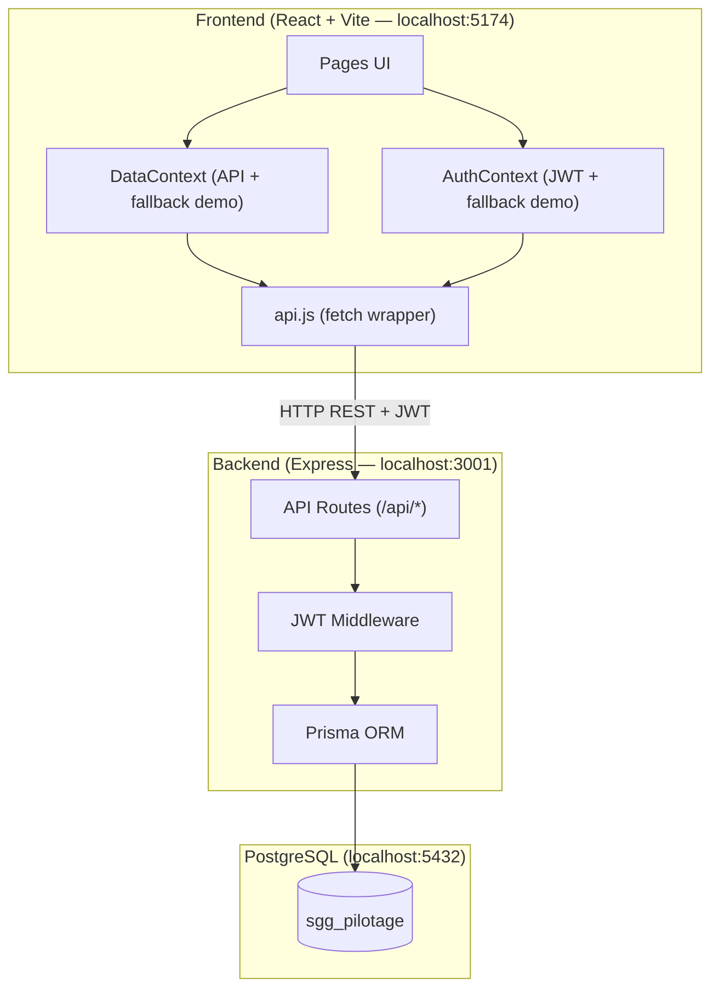

# SGG Pilotage — Transformation Full-Stack

## Résumé des changements

L'application a été transformée d'un frontend avec données mock en mémoire vers une **application agile de pilotage stratégique full-stack**, alignée sur la hiérarchie budgétaire **LOLF** avec reporting BI avancé et moteur d'alertes intelligent.

---

## Architecture



---

## Fichiers créés

### Backend (`server/`)

| Fichier | Description |
|---------|-------------|
| [package.json](file:///c:/Users/ddsi/SGG_projects/sgg-pilotage/server/package.json) | Express 5, Prisma, bcrypt, JWT, multer |
| [.env](file:///c:/Users/ddsi/SGG_projects/sgg-pilotage/server/.env) | `DATABASE_URL`, `JWT_SECRET`, `PORT` |
| [prisma/schema.prisma](file:///c:/Users/ddsi/SGG_projects/sgg-pilotage/server/prisma/schema.prisma) | 10 modèles (User, Project, Phase, Milestone, Risk, etc.) |
| [prisma/seed.js](file:///c:/Users/ddsi/SGG_projects/sgg-pilotage/server/prisma/seed.js) | Données initiales (4 users, 5 projets, 5 risques, budget, KPIs) |
| [src/index.js](file:///c:/Users/ddsi/SGG_projects/sgg-pilotage/server/src/index.js) | Serveur Express avec CORS, routes montées |
| [src/middleware/auth.js](file:///c:/Users/ddsi/SGG_projects/sgg-pilotage/server/src/middleware/auth.js) | Middleware JWT (required + optional) |
| [src/routes/auth.js](file:///c:/Users/ddsi/SGG_projects/sgg-pilotage/server/src/routes/auth.js) | Login (bcrypt), Register, /me |
| [src/routes/projects.js](file:///c:/Users/ddsi/SGG_projects/sgg-pilotage/server/src/routes/projects.js) | CRUD complet + commentaires |
| [src/routes/risks.js](file:///c:/Users/ddsi/SGG_projects/sgg-pilotage/server/src/routes/risks.js) | CRUD + auto-calcul niveau criticité |
| [src/routes/budget.js](file:///c:/Users/ddsi/SGG_projects/sgg-pilotage/server/src/routes/budget.js) | Lecture + mise à jour budget |
| [src/routes/kpis.js](file:///c:/Users/ddsi/SGG_projects/sgg-pilotage/server/src/routes/kpis.js) | Lecture + mise à jour KPIs |

### Frontend (modifié)

| Fichier | Changement |
|---------|------------|
| [api.js](file:///c:/Users/ddsi/SGG_projects/sgg-pilotage/src/services/api.js) | **[NEW]** Client HTTP avec JWT auto-inject |
| [AuthContext.jsx](file:///c:/Users/ddsi/SGG_projects/sgg-pilotage/src/contexts/AuthContext.jsx) | Auth API + fallback démo |
| [DataContext.jsx](file:///c:/Users/ddsi/SGG_projects/sgg-pilotage/src/contexts/DataContext.jsx) | CRUD API + toast + fallback démo |
| [ProjectModal.jsx](file:///c:/Users/ddsi/SGG_projects/sgg-pilotage/src/components/modals/ProjectModal.jsx) | **[NEW]** Formulaire projet (create/edit) |
| [RiskModal.jsx](file:///c:/Users/ddsi/SGG_projects/sgg-pilotage/src/components/modals/RiskModal.jsx) | **[NEW]** Formulaire risque avec calcul live |
| [DeleteConfirmModal.jsx](file:///c:/Users/ddsi/SGG_projects/sgg-pilotage/src/components/modals/DeleteConfirmModal.jsx) | **[NEW]** Confirmation suppression |
| [Projects.jsx](file:///c:/Users/ddsi/SGG_projects/sgg-pilotage/src/pages/Projects.jsx) | Boutons CRUD + modals intégrés |
| [Risks.jsx](file:///c:/Users/ddsi/SGG_projects/sgg-pilotage/src/pages/Risks.jsx) | Boutons CRUD + modals intégrés |
| [Login.jsx](file:///c:/Users/ddsi/SGG_projects/sgg-pilotage/src/pages/Login.jsx) | Login async + spinner |
| [Dashboard.jsx](file:///c:/Users/ddsi/SGG_projects/sgg-pilotage/src/pages/Dashboard.jsx) | Loading guard |
| [Budget.jsx](file:///c:/Users/ddsi/SGG_projects/sgg-pilotage/src/pages/Budget.jsx) | Loading guard |
| [BI.jsx](file:///c:/Users/ddsi/SGG_projects/sgg-pilotage/src/pages/BI.jsx) | Loading guard |

---

## Fonctionnalités Avancées (Page Projet - ProjectDetail)

La page de détails d'un projet a été rendue **100% opérationnelle** avec persistence en base de données :

* **Modification & Suppression** : Boutons d'action rapides avec confirmation sécurisée.
* **Gestion des Phases** : Édition "inline" du pourcentage de progression, changement de statut, ajout et suppression dynamiques, avec mise à jour immédiate du diagramme de Gantt global.
* **Suivi Financier** : Édition en ligne du montant engagé et du taux d'exécution avec un curseur interactif.
* **Jalons** : Ajout avec sélection de date métier, toggle de statuts rapide au clic.
* **Livrables avec Upload de Fichiers** :
  * Possibilité de créer des livrables "simples" (texte) ou d'attacher un **vrai fichier**.
  * Intégration backend avec **Multer** pour enregistrer et servir les fichiers depuis `server/uploads/livrables/`.
  * Affichage des fichiers attachés via une icône dédiée et un lien cliquable permettant le téléchargement.
* **Espace Collaboratif** : Intégration de commentaires persistés en base de données avec gestion du temps relatif (ex: "Il y a 5 min").

---

## Comptes utilisateurs

| Email | Mot de passe | Profil |
|-------|-------------|--------|
| admin@sgg.gov.ma | admin123 | SGG (tous droits) |
| resp@sgg.gov.ma | admin123 | Responsable Programme |
| chef@sgg.gov.ma | admin123 | Chef de Projet |
| audit@sgg.gov.ma | admin123 | Audit (lecture seule) |

---

## Modernisation LOLF & BI

L'application respecte désormais la hiérarchie budgétaire officielle :
**Axe Stratégique** → **Programme Budgétaire** → **Projet** → **Objectif** → **Indicateur (KPI)**.

### Points clés de la mise à jour :
*   **Tableau de bord intelligent** : KPIs calculés en temps réel (Exécution physique, Budgétaire, Score LdF moyen).
*   **Suivi LdF** : Arbre stratégique complet avec saisie de réalisations annuelles.
*   **Moteur d'alertes** : Détection automatique des retards calendaires, dépassements budgétaires et sous-performance des indicateurs LdF.
*   **UI/UX Premium** : Nouvelle palette de couleurs "Emerald Light" conviviale pour les programmes et refonte visuelle des cartes de performance.

---

## Intégration GitHub

Le projet est versionné et synchronisé avec le dépôt distant :
*   **Repo** : `https://github.com/ddsi202535/sgg-pilotage.git`
*   **Fichiers ignorés** : node_modules, .env, uploads/, prisma generated client.
*   **Branch management** : Master branch initialisée avec tout le code source frontend et backend.

---

## Comment lancer

```bash
# 1. Backend
cd server
npm run dev      # → http://localhost:3001

# 2. Frontend  
cd ..
npm run dev      # → http://localhost:5174

# Reset DB
cd server
npx prisma migrate reset --force && node prisma/seed.js
```

---

## Captures d'écran

````carousel

<!-- slide -->

<!-- slide -->

````

---

## Mode de fonctionnement

L'application fonctionne en **deux modes** :
- **Mode API** : quand le backend est démarré → données lues/écrites dans PostgreSQL
- **Mode Démo** : quand le backend est arrêté → données mock en mémoire (lecture seule simulée)

Le basculement est **automatique** : le DataContext teste la santé de l'API au chargement.
